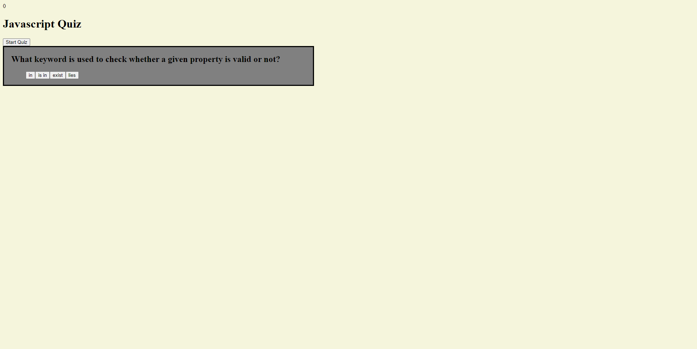

# JavaScript Quiz (literally)

# Description.

This is my quiz featureing dynamically generated questions and answers. I encountered many walls and points of general frustration while working on this particular project overall ,I invested far too much time on this already with little progress im now opting to submit now then return at a later date to refactor/ bring to completion for course.

# Credits.

Although my project is not finished thats not to say i didnt get help along the way including from my fellow peers and a few tutor sessions dedicated to said project.

# How to use

Though incomplete you can still play the quiz and see that the timer reflects correct/incorrect answers. Missing yet is the feature to save scores to local storage.

# Wrap Up

although I felt I still learned along the proccess of getting the project to its current state Im aware of places i can work on for the next time I revisit this project such as a proper method for ending game and saving to local storage. I would have liked to bring this project to complete but am opting to continue onto next homework assignments for mean time to catch up with rest of cohort.

below is a screenshot of project at current state!

Link to GitHub Project Page: https://github.com/KeeslingB/javascript-quiz

link to Projects Deployed Page: https://keeslingb.github.io/javascript-quiz/

